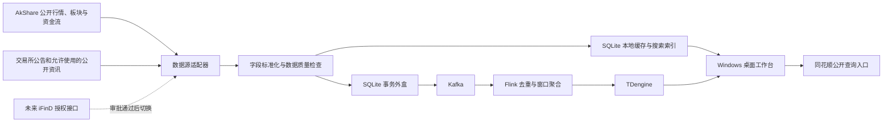
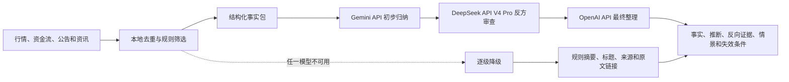

# A股自动化监控终端设计规格

**日期：** 2026-08-13

**状态：** 已获用户分段批准，等待书面规格最终复核

**产品阶段：** Windows 桌面前版本

**数据方案：** 方案 A——公开源自动化运行，同花顺仅作为查询入口，iFinD 授权后切换为主源

## 1. 目标

在现有 A 股桌面监控软件上建设一个接近同花顺信息终端使用习惯的工作台，支持全市场搜索、股票详情、分时/K 线、板块联动、资金流、公告与资讯、数据源健康状态，以及带证据的情景观察。

系统必须自动更新，但不得把公开数据源描述成交易所授权实时行情；不得破解、逆向、抓取受限同花顺客户端或网页接口；不得自动交易、承诺收益或输出无条件买卖指令。

## 2. 已确认的约束

- 用户当前只有普通同花顺账号，iFinD/QuantAPI 授权尚未通过。
- 本机目前未配置 iFinD、TuShare、财联社授权 API 凭据。
- 同花顺普通账号阶段只提供公开股票页面或客户端查询入口，不自动读取或控制同花顺。
- 财联社只允许合同授权 REST API；没有合同权限时仅打开官网原文，不抓取正文。
- 自动行情、板块和资金流先使用 AkShare 等公开适配器，并明确显示来源、延迟与口径风险。
- 未来 iFinD 审批通过后，以独立适配器接入；字段、QPS、并发、行情类型和资金流权限以合同为准。
- 本地 SQLite 模式必须独立可运行；Kafka、Flink 或 TDengine 中断不能停止桌面监控。
- API 密钥与 Token 存入 Windows 凭据库，不写入普通配置文件或日志。

## 3. 研究与技术依据

### 3.1 模型研究结论

- Gemini 会员网页因保存的浏览器权限策略被阻止，本轮研究草案来自 **Gemini API**，不能描述成 Gemini 网页会员或 Deep Research 网页调用。
- **DeepSeek API · V4 Pro** 对方案 A 进行了反方审查。结论是：公开源可以作为过渡方案，但不能承诺准实时、完整或稳定；界面必须展示时间戳、来源、延迟、缺失和失败状态；模型不可用时退回原文标题与链接。
- GPT 负责将研究草案、DeepSeek 审查、现有代码约束和开源架构经验合并为本规格。

### 3.2 GitHub 架构借鉴

- `vnpy/vnpy`：借鉴事件驱动、数据源 Gateway/Adapter 和业务模块解耦。
- `microsoft/qlib`：借鉴原始数据、标准数据、特征与信号分层。
- `klinecharts/KLineChart`：借鉴交互方式和图表布局；当前 Tkinter 阶段不引入 Node 运行时。
- `fasiondog/hikyuu`：仅参考 A 股数据抽象与研究组件边界，不引入其 C++ 构建复杂度。

不复制上述项目中的数据爬虫、交易接口或未经验证的源代码。引入任何代码前须单独核对许可证和依赖许可证。

## 4. 总体架构

### 4.1 运行原则

1. 所有供应商先映射到稳定的领域模型，桌面页面不得直接依赖 AkShare、iFinD 或财联社原始字段。
2. SQLite 保存配置、证券目录、自选股、最新快照、历史数据、资讯证据、调度状态、告警和事务外盒。
3. 高级数据流开启时，标准事件从事务外盒发送到 Kafka，经 Flink 去重、事件时间处理和窗口聚合后写入 TDengine。
4. 高级栈不可用时，事件留在事务外盒，SQLite 页面继续运行，恢复后补发。
5. 任一股票或任一数据源失败不得阻断其他股票、页面或调度任务。

## 5. 同花顺式工作台

布局以用户批准的可视化草图为准。

### 5.1 顶部

- 全局搜索：支持证券代码、中文简称、拼音首字母、行业和概念板块。
- 交易时段：显示盘前、集合竞价、连续竞价、午间休市、收盘处理或休市。
- 数据健康：显示主数据源、降级状态、最近数据时间和下一轮刷新倒计时。
- 快捷操作：立即刷新、数据源设置。

### 5.2 左侧

- 自选股列表：名称、代码、最新价、涨跌幅和数据新鲜度。
- 行业和概念板块树。
- 热门板块及资金净流入/流出排名。

### 5.3 中央

- 股票标题、代码、行业、最新价、涨跌额、涨跌幅、来源和时间戳。
- 分时、K 线、资金流和基本面标签页。
- 当前阶段继续使用现有 Tkinter 图表；K 线支持日/周和不复权/前复权口径，分时使用不复权成交价。
- 关联资讯与公告列表，双击打开原文。
- 个股资金流分单与供应商口径说明。

### 5.4 右侧

- 盘口区域：只有数据源返回可靠、合同允许且通过字段校验时显示五档/十档；否则显示“数据不可用”，不使用旧数据冒充实时盘口。
- 板块联动：个股所属行业、概念、宽基指数和相对强度。
- AI 证据摘要：客观事实、系统推断、反向证据、情景观察、失效条件和复核时间。

### 5.5 同花顺入口

- “同花顺查询”按钮只打开与当前证券对应的公开查询页或已安装客户端的合法入口。
- 页面跳转不得声明同花顺对本软件提供数据授权。
- 不读取同花顺登录态、Cookie、客户端内存、网络协议或未公开接口。

## 6. 全市场证券目录与搜索

### 6.1 最小证券契约

每条证券记录至少包含：

- `symbol`：标准代码，例如 `600519.SH`。
- `name`：证券简称。
- `pinyin_abbr`：拼音首字母。
- `exchange`：上交所、深交所或北交所。
- `security_type`：股票、ETF、指数或板块；第一阶段搜索结果默认展示股票和板块。
- `industry`：当前行业分类及分类来源。
- `concepts`：概念板块列表及分类来源。
- `list_date`、`delist_date`。
- `trade_status`：正常、停牌、退市整理、退市或未知。
- `source`、`source_timestamp`、`collected_at`。

### 6.2 索引

- SQLite FTS5 保存代码、名称、拼音和板块关键词。
- 搜索输入不依赖网络；详情页先从本地缓存打开，再异步刷新。
- 排序优先级：代码前缀完全匹配、名称前缀、拼音前缀、名称包含、板块匹配。
- 本地搜索 P95 目标不超过 50 毫秒。

### 6.3 更新

- 软件启动时检查证券目录版本。
- 每个交易日盘前更新一次，收盘后再校验一次。
- 新股、退市、改名、停牌和板块归属变更采用幂等更新。

## 7. 标准数据契约

### 7.1 行情快照

至少包含：

- 标准代码、最新价、涨跌额、涨跌幅。
- 开盘、最高、最低、昨收。
- 成交量（统一为股）、成交额（统一为元）。
- 交易状态、供应商数据时间、本机采集时间。
- 数据源、复权方式、质量状态和质量原因。
- 可选盘口字段；缺失时保持空值，不猜测。

### 7.2 资金流

至少包含：

- 对象类型、对象代码、对象名称。
- 主力、超大单、大单、中单和小单净额；不可获得的层级保持空值。
- 净占比、涨跌幅、供应商时间、采集时间。
- 来源和口径说明。
- 资金流属于供应商估算口径，不等同于真实机构账户资金。

### 7.3 板块

至少包含板块代码、名称、分类体系、涨跌幅、成交额、主力净额、上涨/下跌家数、领涨股、来源和时间戳。不同来源的行业或概念分类不得无标识地混为同一个板块。

### 7.4 资讯和公告

至少包含外部 ID、来源、标题、发布时间、原文 URL、相关证券、相关板块、允许存储的证据片段、采集时间和去重指纹。财联社字段仅在取得合同文档后映射。

## 8. 自动调度

公开源频率是调度目标，不是实时服务等级承诺。实际频率由接口延迟、失败率和限流反馈动态调整。

| 时段 | 任务 | 目标频率 |
|---|---|---|
| 软件启动 | 证券目录版本、交易日、自选缓存 | 一次 |
| 交易日盘前 | 证券目录、历史 K 线、复权因子、盘前公告 | 一次 |
| 集合竞价 | 全市场快照 | 60 秒；公开源不承诺竞价级数据 |
| 连续竞价 | 全市场快照 | 60 秒 |
| 连续竞价 | 当前股票与自选展示 | 从全市场快照提取；必要时目标 30 秒单独刷新 |
| 连续竞价 | 个股与行业资金流 | 2–3 分钟 |
| 连续竞价 | 板块排名 | 2–3 分钟 |
| 连续竞价 | 公告与公开资讯 | 3–5 分钟 |
| 午间休市 | 行情检查 | 5 分钟 |
| 15:00 后 | 收盘价、成交量、资金流终值、复权和对账 | 一次，失败后有限重试 |
| 非交易时间 | 公告与资讯 | 15 分钟 |

同一端点只由一个调度任务调用，再将结果分发给页面，避免逐股票并发轮询。接口返回限流、超时或端点异常时，降低频率并进行带抖动的指数退避。

## 9. 数据质量、熔断与降级

### 9.1 每条记录的可审计信息

- 供应商数据时间。
- 本机采集时间。
- 数据来源。
- 复权方式、价格单位、成交量单位和金额单位。
- 正常、延迟、停滞、降级或可疑状态。
- 质量原因、最近成功时间和连续失败次数。

### 9.2 校验规则

- 时间戳不能倒退，未来时间必须进入隔离区。
- OHLC、成交量和金额必须满足类型、范围、NaN 和 Inf 约束。
- 实时/分时价格不复权；技术指标使用明确标记的前复权序列。
- 同一指标序列不得混用不同供应商或不同复权口径。
- 跨源差异只用于质量告警，不自动认定任一来源正确。
- 价格异常、时间停滞、字段缺失或跨源偏差超过配置阈值时标记为可疑，并暂停生成新的智能结论。

### 9.3 故障处理

- 单请求失败执行有限重试和指数退避。
- 连续失败达到阈值后熔断；探测恢复成功后自动闭合。
- 旧缓存可以继续展示，但必须标记最后数据时间和“非实时/已停滞”。
- 旧数据不得覆盖较新的有效数据。
- 公开端点结构变化必须形成明确错误，不允许静默猜测新字段。

## 10. AI 摘要与模型链路

### 10.1 调用边界

- Gemini 网页会员不能作为桌面软件后台接口，不能自动操控网页持续生成摘要。
- 自动化 Gemini 阶段必须使用独立 Gemini API Key；未配置时跳过。
- DeepSeek 使用用户配置的 `deepseek-v4-pro` API；密钥存入 Windows 凭据库。
- GPT 最终整理必须使用独立 OpenAI API Key；当前 Codex/ChatGPT 会话不能作为软件后台服务。
- 只有 DeepSeek Key 时，系统使用“本地规则 → DeepSeek V4 Pro → 本地格式校验”。
- 所有模型均为可选增强；数据采集、搜索和规则摘要不得依赖模型可用性。

### 10.2 触发与成本控制

- 重复消息、普通会议通知和无关联事件只走本地规则。
- 业绩、回购、增减持、重大合同、监管处罚等高价值事件进入模型队列。
- 同板块事件按三分钟窗口聚合。
- 个股摘要只在新事件、资金方向反转、价格异动、旧摘要失效或用户主动刷新时重算。
- 盘前、午间和收盘后生成市场及板块总览。
- 设置每日调用次数和费用上限；达到上限后使用本地规则摘要。
- 请求以内容指纹幂等去重；重启后不重复提交已完成事实包。

### 10.3 证据契约

每个事实包和摘要版本至少保存：

- 原始标题、来源、发布时间、URL和允许存储的证据片段。
- 相关证券和板块。
- 行情及资金流来源时间。
- 摘要生成时间、模型 ID、供应商、提示词版本和事实包哈希。
- 客观事实、系统推断、未知项、反向证据、情景、失效条件和复核时间。
- 置信度、数据新鲜度和上一版本失效/替换原因。

模型只能使用输入事实包。不能被证据引用支持的陈述不得进入最终摘要。

### 10.4 输出格式

1. **客观事实**：由原始数据、公告或资讯直接支持。
2. **系统推断**：明确标为推断并说明依据。
3. **反向证据和未知项**：列出冲突数据、缺失信息和口径风险。
4. **情景观察**：只使用“若……则可能……”形式。
5. **失效条件**：数据过期、资金反转、价格结构改变或出现风险公告等。
6. **复核时间**：下一次自动检查时间。
7. **免责声明**：不构成投资建议，不自动下单，不承诺收益。

### 10.5 模型失败降级

- 任一模型超时、返回格式错误或证据引用不完整，退回上一层有效结果。
- 全部模型不可用时，只显示规则摘要、原始标题、来源和原文链接。
- 旧摘要可以显示历史版本，但必须标记生成时间和失效状态，不得冒充新分析。

## 11. 模块边界

- `instrument_catalog`：证券目录、拼音、行业、概念和交易状态。
- `market_snapshot`：全市场快照、自选行情和当前股票刷新。
- `sector_monitor`：行业与概念板块涨跌、成交额和资金排名。
- `announcement_provider`：交易所公告与允许使用的公开资讯。
- `provider_router`：公开源、未来 iFinD 和其他持牌源的优先级、熔断与降级。
- `market_scheduler`：交易日历、交易时段和动态刷新。
- `evidence_store`：原始证据、事实包和模型摘要版本。
- `summary_pipeline`：本地规则、Gemini、DeepSeek、OpenAI 和逐级降级。
- `desktop/pages`：工作台、股票详情、板块、资讯、智能摘要和数据源设置。
- `desktop/widgets`：搜索、行情表、图表、盘口占位、来源状态和风险提示。

各模块通过领域模型和服务接口通信，不导入具体页面实例，不直接读取其他模块数据库表。

## 12. 桌面技术路线

- 第一轮继续使用 Python、Tkinter、SQLite 和 PyInstaller，不立即迁移 PySide6。
- 将当前过大的 `desktop.py` 按页面与组件拆分，但不进行与本目标无关的重构。
- 后台任务继续与 Tk 主线程隔离；UI 仅通过事件队列接收不可变结果。
- 第一轮继续使用现有图表组件，不引入 Node 运行时。
- 将领域服务和页面解耦，为未来迁移 PySide6、WebView 或其他渲染层保留可能性。

## 13. 实施阶段

### 阶段 1：数据自动化基础

- 全市场证券目录和 FTS5 搜索。
- 全市场快照、自选行情和当前股票刷新。
- 板块排行、个股/板块资金流。
- 公告及允许使用的公开资讯增量同步。
- 交易日调度、数据源健康和同花顺查询入口。

阶段完成时，系统无需任何模型 API 即可自动更新和查询。

### 阶段 2：同花顺式桌面工作台

- 按批准草图重组布局。
- 股票详情、分时/K 线、板块联动、资金流和资讯列表。
- 每个页面展示来源、数据时间、采集时间、延迟和质量状态。
- 无可靠盘口时显示“数据不可用”。

### 阶段 3：证据型智能摘要

- 事件队列、内容去重和三分钟板块窗口。
- 模型预算、熔断与逐级降级。
- Gemini API → DeepSeek V4 Pro → OpenAI API 链路。
- 事实引用、反向证据、情景、失效条件和版本历史。
- 重新构建 Windows EXE，验证桌面副本，并保留原配置和凭据。

### 独立后续：iFinD 授权接入

审批通过后，按合同文档单独设计和验证：

- refresh token 获取与轮换。
- 支持的行情类型、历史周期、快照/订阅能力。
- QPS、并发、日配额和可缓存范围。
- 盘口、资金流、资讯、公告和板块字段。
- 数据展示、再分发、存储时长和终端数量限制。

未确认合同字段前不得在代码中假定能力或频率。

## 14. 测试与验收

### 14.1 功能与性能

- 代码、中文名或拼音搜索 P95 不超过 50 毫秒。
- 详情页先显示缓存，后台刷新不冻结 UI。
- 每条行情、资金流和资讯显示来源、供应商数据时间、采集时间和新鲜度。
- 全市场快照不按股票逐个轮询。
- 同一端点在同一调度周期只请求一次。

### 14.2 故障与质量

- 单股票或单数据源失败不阻塞其他任务。
- 限流、超时和结构变化触发退避、熔断与清晰状态。
- 恢复后继续增量同步，不重复写入。
- 未来时间、时间倒退、NaN、Inf、异常 OHLC 和错误单位被拒绝或隔离。
- 旧数据不显示为实时，不覆盖较新记录。
- Docker/Kafka/Flink/TDengine停止时，SQLite 桌面功能继续运行。

### 14.3 AI

- 未配置任何模型 Key 时，规则摘要和原文链接可用。
- 每个最终事实有证据引用；无证据陈述被格式校验拒绝。
- 模型超时、无文本、无效 JSON、费用上限和部分供应商失败均有自动降级测试。
- 所有智能结论包含事实、推断、反向证据、情景和失效条件。
- 过期或可疑数据阻止生成新的智能结论。

### 14.4 桌面交付

- 自动化测试覆盖搜索、调度、限流、字段映射、熔断、证据和模型降级。
- PyInstaller 构建成功。
- 桌面 EXE 从桌面路径启动并通过冒烟测试。
- 升级后原有配置、观察列表、数据库和 Windows 凭据不丢失。

## 15. 明确不做

- 不破解、逆向、抓包或自动控制普通同花顺客户端。
- 不抓取受限制或未经合同授权的同花顺、财联社网页内容。
- 不以公开源盘口、资金流或资讯冒充交易所或持牌实时数据。
- 不把 Gemini 网页会员、ChatGPT 会话或 Codex 会话当作桌面软件 API。
- 不自动下单，不接券商交易权限，不给出“必涨”“保证收益”等结论。
- 不在第一轮迁移 PySide6，不引入与目标无关的复杂重构。

## 16. 风险提示

桌面界面必须持续可见地提示：

- 公开数据可能延迟、缺失、错误、限流或随源站变化失效。
- 资金流属于供应商计算口径，不等同于真实机构账户资金。
- 不同来源的复权、板块和资金流口径可能不同。
- AI 摘要必须核对原文，可能遗漏、误判或过时。
- 同花顺页面跳转不代表数据授权。
- 软件仅作信息整理和情景观察，不构成投资建议，不自动交易，不承诺收益。
